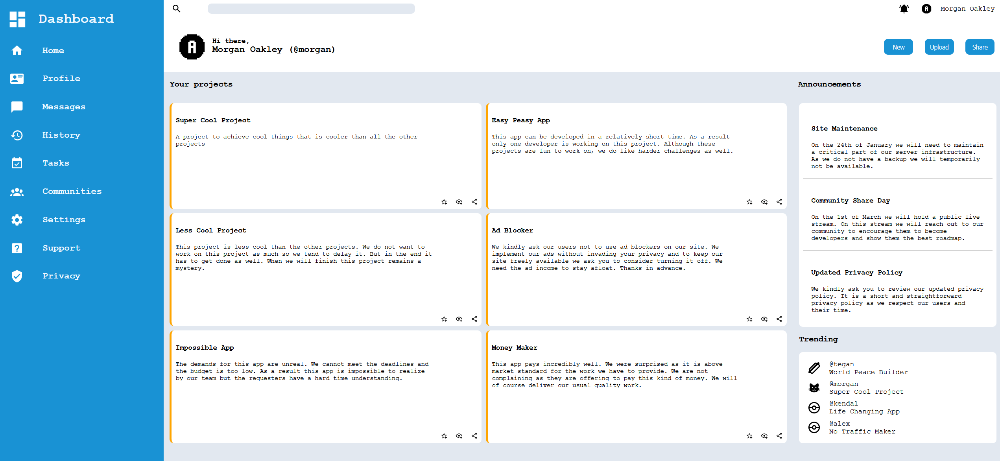

# Admin Dashboard

This project uses HTML and CSS to practice CSS Grid and use of SVG icons.

## The Odin Project: Lesson Admin Dashboard

This project is build according to the specification of the [Admin Dashboard lesson](https://www.theodinproject.com/lessons/node-path-intermediate-html-and-css-admin-dashboard)

## Live website

Access the [Admin Dashboard](https://gohan61.github.io/Admin-Dashboard)

